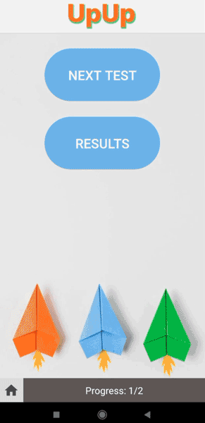

### UpUp React Native App

Ready for some fun with quizzes? Our UpUp React Native App is now available for testing! We are looking for enthusiastic testers to provide valuable feedback and help us improve the app.

To participate in the testing, please follow these steps:

1. Send us an email at mailtogrigoryeva@gmail.com with the subject line "UpUp App Testing" and include the email associated with your Google Play account on your Android phone.

2. Once we receive your email, we will add you to the testers' list.

3. After you've been added, you can download the app from the Google Play Store using this [Testing Link](https://play.google.com/apps/internaltest/4701683346244663891).

We can't wait for you to try out our app and share your feedback! If you have any questions or need assistance, feel free to reach out to us at mailtogr@gmail.com. Enjoy the quizzes!

If you'd rather set it up locally, follow the instructions given below. Let's dive in!

## Getting Started

To start the project, you will first need to download the code from this GitHub repository. Once you have downloaded the code, navigate to the project directory in your terminal and run the following command to install the dependencies:

npm install

After the dependencies are installed, run the following command to start the development server:

npm start

Once the server is running, you will see a QR code in the terminal. Scan this code using your phone's camera and you will be able to view the app on your phone.

## App Functionality

The main functionality of this app is to provide the user with preset quizzes. The app is still under construction and more functionality will be added in the future.

## Prototype

The prototype for this app was built in Figma and can be found at the following link:

https://www.figma.com/file/PhHdgdUDE7XxQtD3I2wRPK/2023-test-application?node-id=0%3A1&t=x6SZsiyXUYrYXoXd-1

## Backend Repository

The backend for this app is stored in a separate GitHub repository which can be found at the following link:

https://github.com/NGFuture/UpUp-backend

## Deployed Backend

The backend for this app is deployed on the following URL:

https://upup-backend.vercel.app

## Credits

Background picture: <a href="https://www.freepik.com/free-photo/top-view-colorful-paper-planes_4388480.htm#query=paper%20planes%20on%20gray%20background&position=4&from_view=search&track=ais">Freepik</a>

## Demonstration

# **Thank you for using the UpUp React Native App!**
